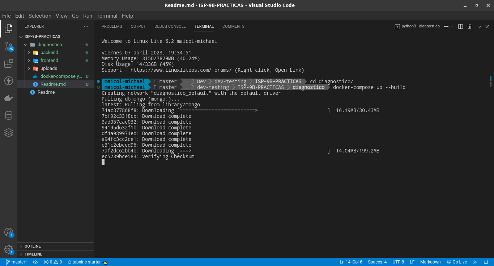
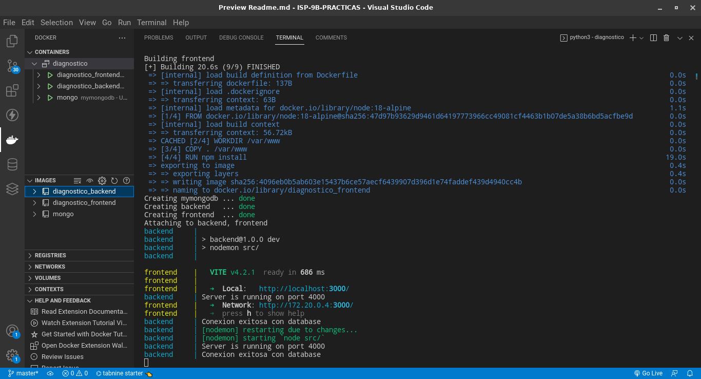
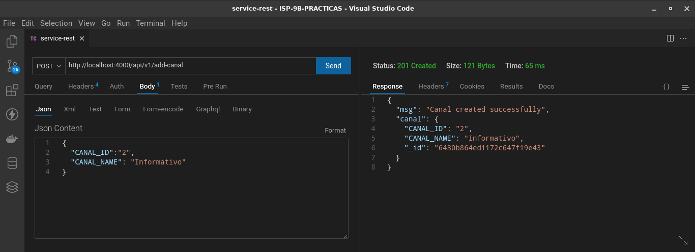
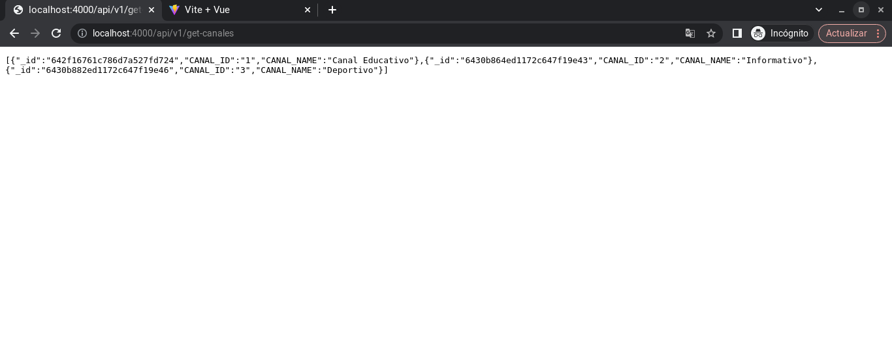
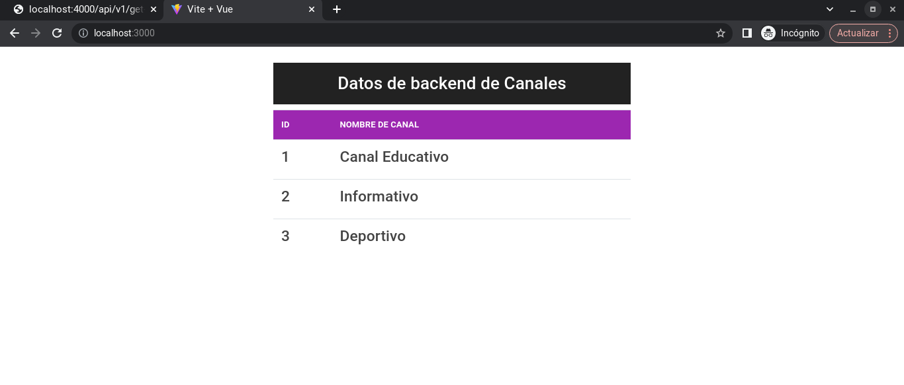

# DIAGNOSTICO
## BACKEND
- Desarrollado con nodejs

## FRONTEND
- Desarrollado con vuejs

### DESARROLLO
- Se definieron las carpetas para frontend y backend.
- Dentro de cada carpeta se creo un archivo Dockerfile con su respectiva configuracion de imagen, directorio de trabajo y comando de ejecución.
- Se definio el archivo docker-compose.yml para definir los servicios que se utilizaran, donde se definieron puertos, volumenes, variables de entorno, etc
### IMAGENES

***SERVICIOS LEVENTADOS***

***BACKEND PETICION POST***

***BACKEND PETICION GET***

***FRONTEND***
