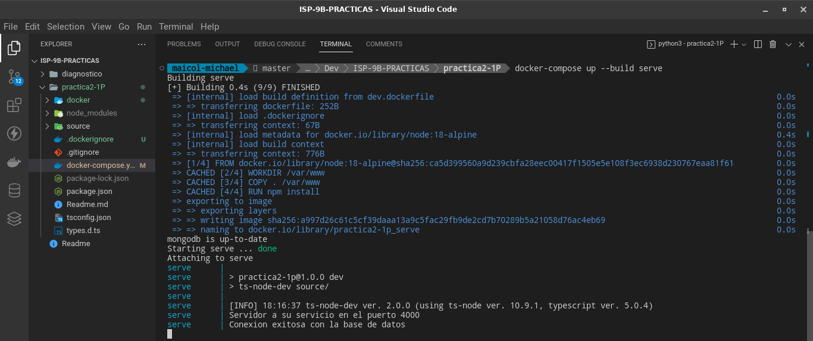
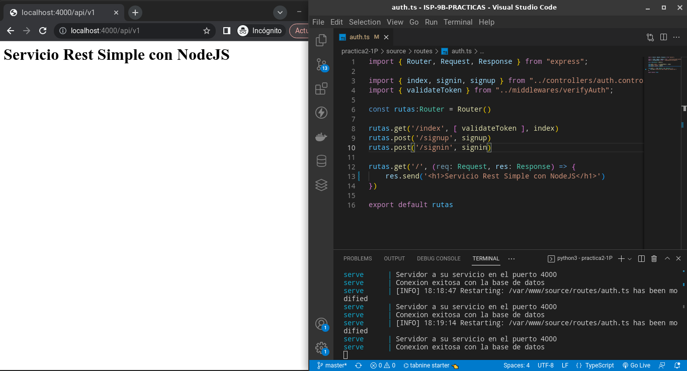
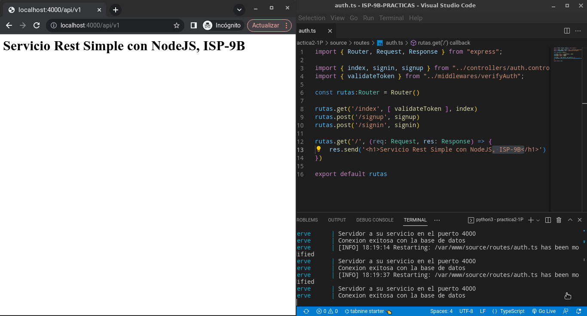
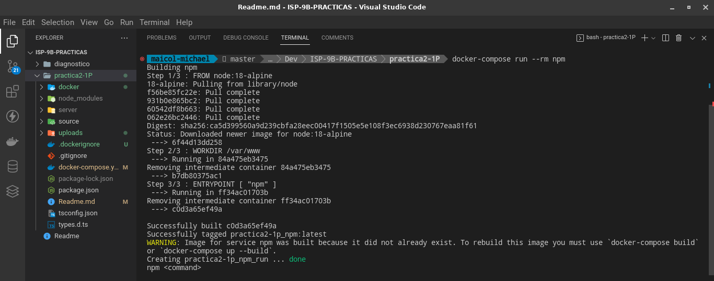
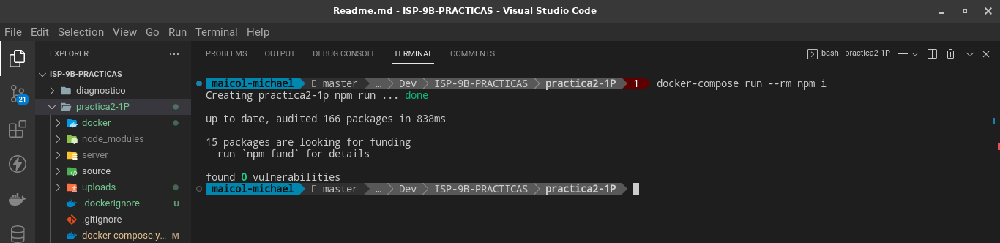
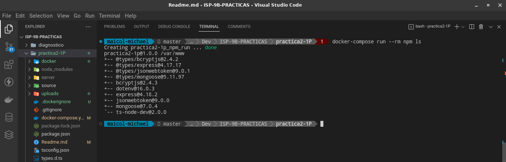
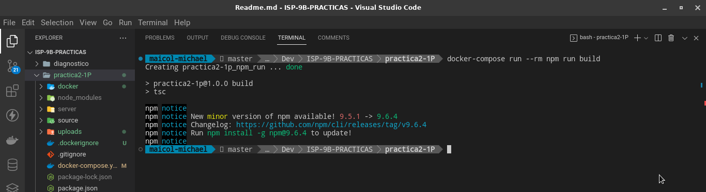
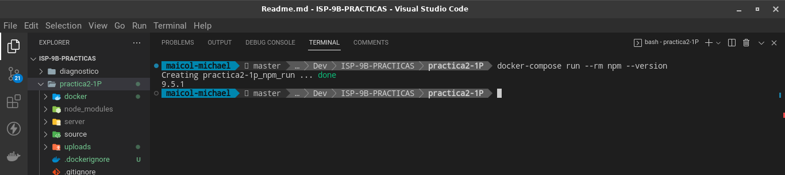

# PRACTICA 2 -1P

### API REST SIMPLE EN TYPESCRIPT

### CONFIGURACION
- Dentro de la carpeta docker se creoron los archivos dockerfiles con su respectiva imagen, directorio de trabajo y comando de ejecución.
- Se definio el archivo docker-compose.yml para definir los servicios a utilizar, definiendo puertos, volumenes, variables de entorno, etc

### ACCESO A DOCKER DE FORMA INTERACTIVA

**INICIALIZACIÓN:**
***docker-compose up --build serve***

### CAMBIOS DESDE EL HOST

**INICIALIZACIÓN:**
***docker-compose run --rm npm***

**INSTALACIÓN DE MODULOS:**
***docker-compose run --rm npm i***

**DEPENDENCIAS INSTALADAS:**
***docker-compose run --rm npm ls***

**BUILD DE TYPESCRIPT A JAVASCRIPT:**
***docker-compose run --rm npm build***

**VERSION NPM:**
***docker-compose run --rm npm --version***
