## PRACTICA 3/1-P
---

### 1 - SERVICIO REST
    - METODO POST
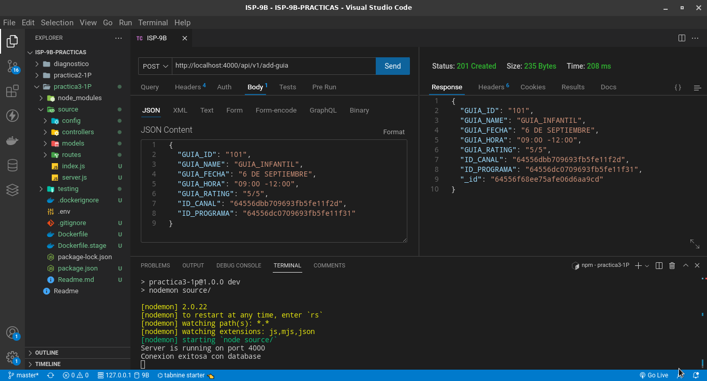

    - METODO GET
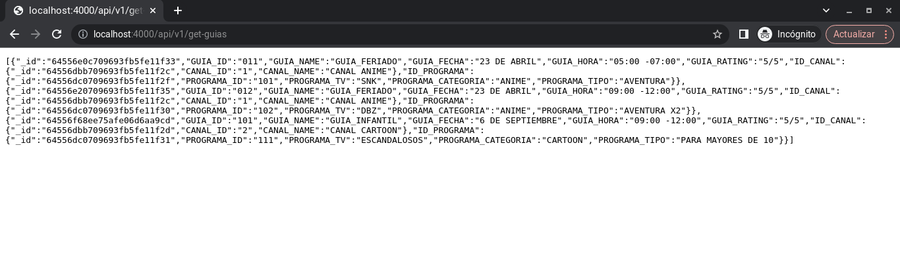

### 2 - TEST UNITARIOS
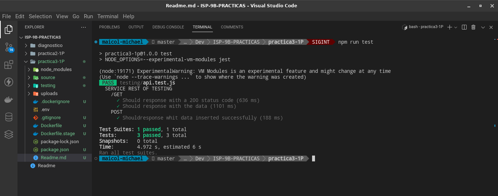

### 3 - DOCKERIZACION DE SERVICO REST Y PRUEBAS UNITARIAS
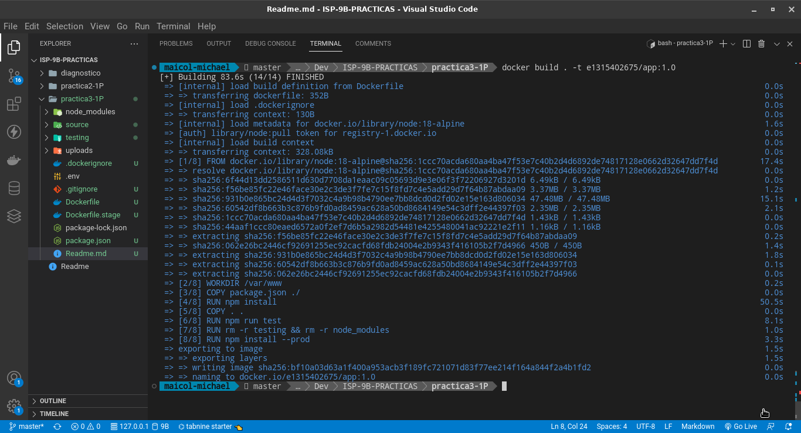

### 4 - DOCKERIZACION MULTISTAGE
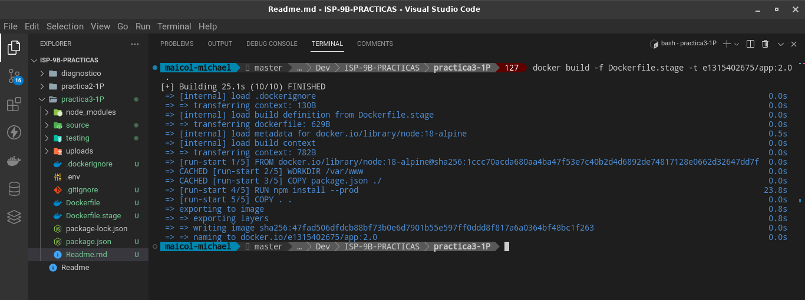

### 5 - DOCKER HUB
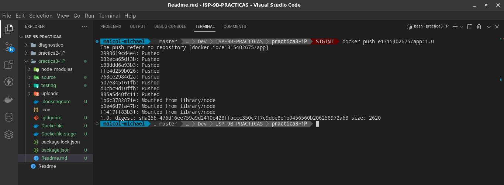
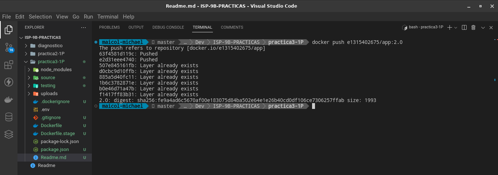
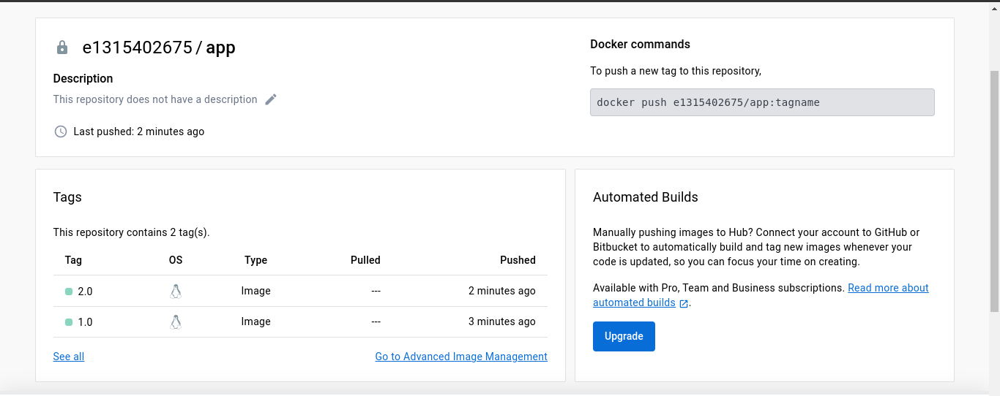

### 6 - PRUEBA DE IMAGEN LOCALMENTE
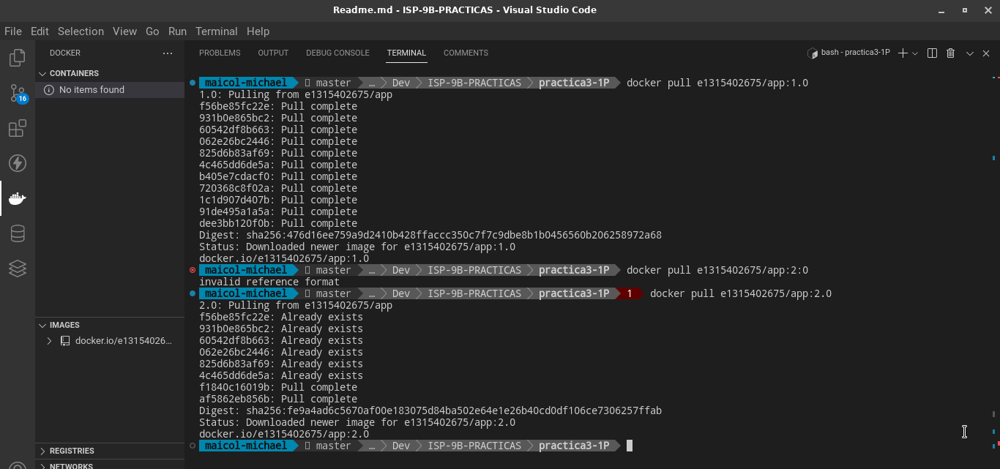
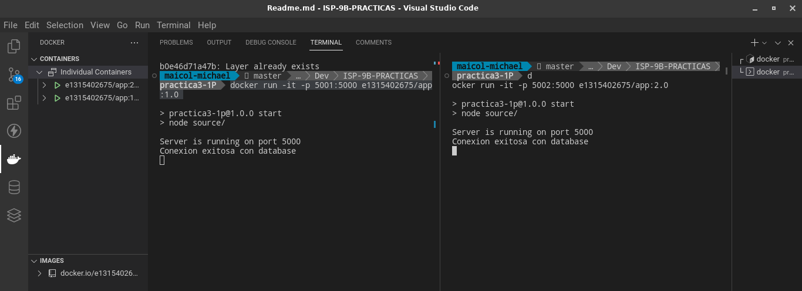
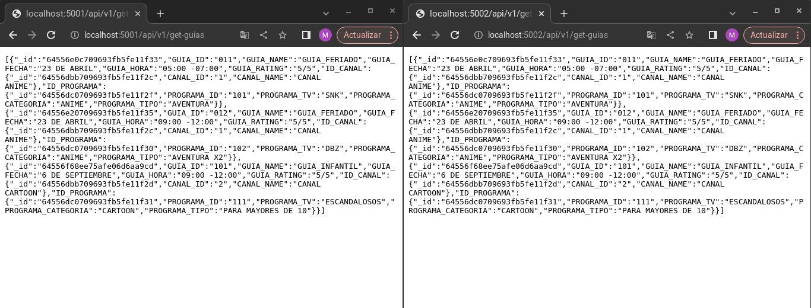